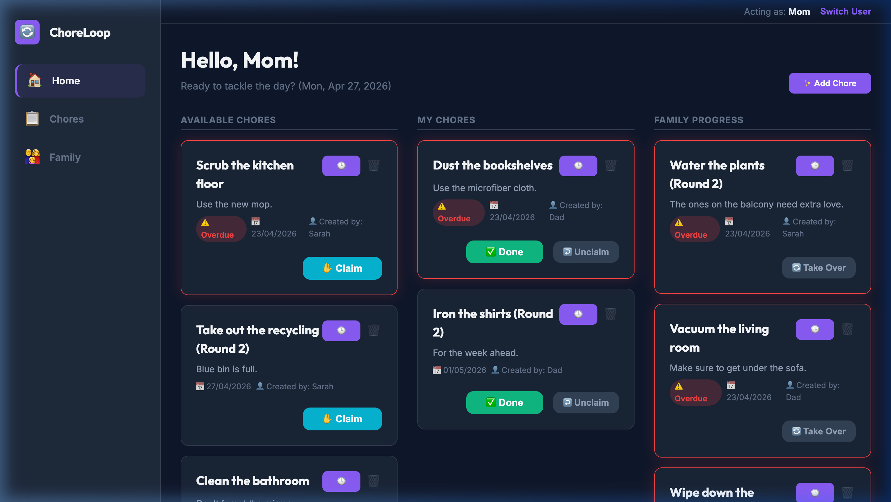

# 🔄 ChoreLoop

[](https://php.net/)
[](https://www.mysql.com/)
[](LICENSE)
[](tests/)
[](public/api/)

> **Shared household coordination, simplified.**

ChoreLoop is a production-grade, shared-device task management system designed for high-trust environments like families and shared households. Optimized for the "Always-Online" nature of a tablet mounted on a fridge, it replaces complex permission hierarchies with a **Flat Trust Model** and **Atomic State Management**.



## ✨ Core Philosophy

### 🤝 Flat Trust Model
No passwords, no hierarchy. Anyone in the household can join, claim chores, and help out. Ownership is visible but non-exclusive, encouraging "Take Over" actions that foster coordination rather than competition.

### 🛡️ Atomic State Machine
The backend is built on a robust state machine that prevents race conditions. Using transactional integrity, ChoreLoop ensures that even if two family members click "Claim" at the exact same millisecond, only one succeeds with a 409 Conflict handled gracefully by the UI.

### 🕒 Soft Accountability
Every action (Created → Claimed → Done → Taken Over) is automatically logged in a glassmorphic Activity Feed. This creates a transparent history of "who did what" without the friction of a traditional audit log.

---

## 🛠️ Tech Stack

### Backend: Engineering Excellence
- **Core:** PHP 8.2 (Pure RESTful API with Procedural-to-Service Transition)
- **Database:** MySQL 8.0 (InnoDB with Transactional State Controls)
- **Security:** Strict UUID enforcement, Prepared Statements (SQLi Protection), and Bearer Token authentication.
- **Testing:** Comprehensive PHPUnit 10 suite covering Unit, Integration, and Concurrency.

### Frontend: Premium UX
- **Logic:** Vanilla JavaScript (ES6 Modules, No-Framework State Management)
- **Styling:** Modern Vanilla CSS using Design Tokens and Glassmorphism.
- **Animations:** High-performance Canvas-based celebrations and micro-interactions.
- **Mobile-First:** Fully responsive design with a persistent Bottom-Nav for mobile and a structured Sidebar for tablet/desktop.

---

## 🚀 Quick Start

The project is fully containerized for a one-command "Zero-Config" setup.

### 1. Requirements
- Docker & Docker Compose
- Make (Recommended)

### 2. Setup & Launch
```bash
make setup
```
*This builds the images, spins up containers, installs dependencies, and runs migrations.*

### 3. Usage
- **Web App:** [http://localhost:8080](http://localhost:8080)
- **API Root:** [http://localhost:8080/api/](http://localhost:8080/api/)

---

## 🧪 Testing Suite

ChoreLoop features a high-fidelity testing ecosystem designed to survive production-level scrutiny.

```bash
# Run the entire exhaustive suite with pretty TestDox output
make test
```

### Coverage Highlights
- **Unit Tests (Service Layer):** Isolated business logic testing using Mock PDO objects.
- **Integration Tests:** End-to-end API verification on a live MySQL instance.
- **Concurrency Tests:** Uses `curl_multi` to simulate millisecond-accurate race conditions.
- **Security Penetration:** Validated protection against SQL Injection and malformed payloads.

---

## 🏗️ Infrastructure & Tooling

| Command | Description |
|---------|-------------|
| `make setup` | Full initial setup, migration, and seeding |
| `make seed` | Reset and populate the DB with demo data |
| `make test` | Run automated tests with pretty TestDox output |
| `make status` | Check container health and healthchecks |
| `make shell` | Enter the PHP application container |
| `make db-shell` | Open the MySQL monitor (root) |
| `make destroy` | Wipe the entire environment and data |

---

**Built with a focus on engineering integrity and family harmony.**
